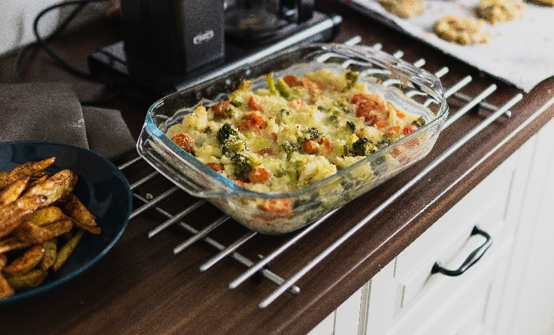
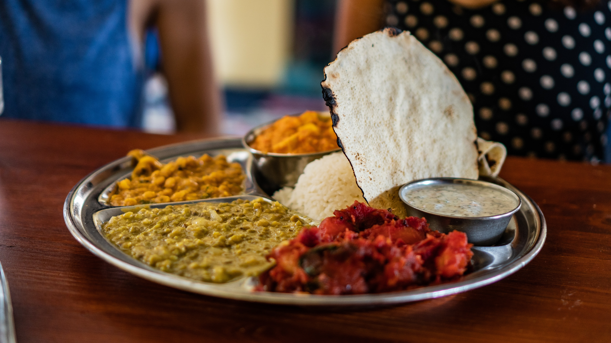
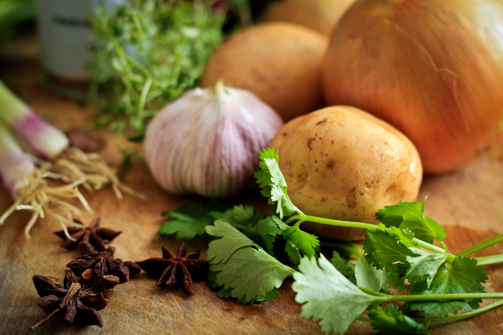
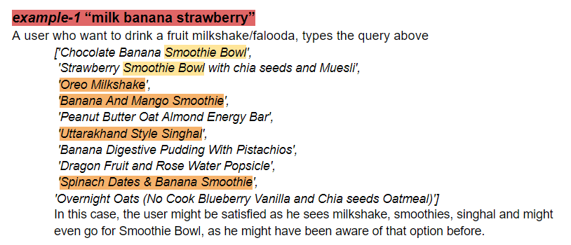
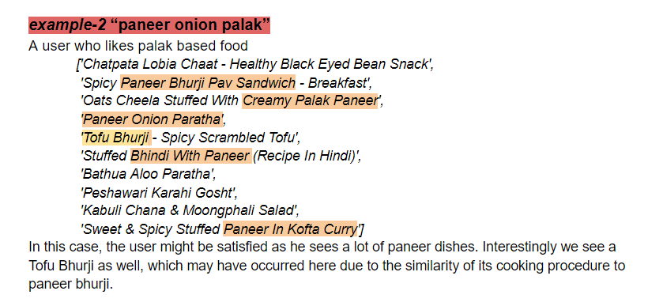
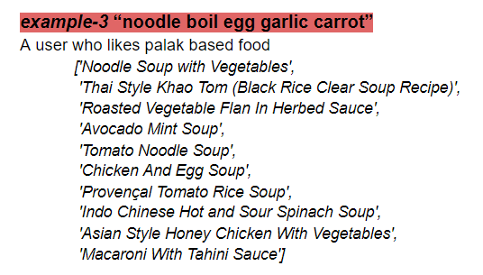

# ‘food-item’ search using recipe embeddings
A simple embedding based search engine using gensim, fastText and ElasticSearch

This is an introductory lesson in building a search ML product. Where we’ll be using a tool (genSim) to train a language model (fastText), and then index the data onto a scalable search infrastructure (ElasticSearch), and write a custom search functionality to try the embedding based search. 

Indian food is really diverse, and these embeddings did a satisfactory work in suggesting required recipes from different cuisines. It's still a work in progress.

## Goal
To create a smart search application using word embeddings on recipe data, to suggest food-items based on content-heavy queries. We’ll be able to use it for multiple purposes, but we’ll just try to generate results given a query, by measuring distances between query-vectors and food-item-vectors on trained embeddings. And then we’ll index the data and use the search functionality.

## Data 
Data source: The dataset is a public domain dataset sourced from Kaggle. 6000 Indian Food Recipes Dataset
Data exploration and preprocessing: All the necessary preprocessing has been done as required for text fields, both in order to train the embeddings and to use them. More details are available in the notebook. I mainly used the two columns Ingredients and Recipe in order to be able to train word vectors on them. 
Stack used Gensim, ElasticSearch, Pandas 

## recipeEmbeddings : Trained a fastText language model using Gensim
Since this dataset is a recipe dataset, we can train a linguistic model on the recipes. Dishes are the result of execution of a sequence of certain steps using certain ingredients. In fact, recipes are made sequential structure which makes it good for sequential tasks on food.

Here, we are trying to build a food/dish-suggestion application, and we want embeddings which would do that. We are trying to suggest dishes, and we have the recipe of each. Hence, the nature of the input field is already in a sequential manner, the output we want will be a list of dishes in decreasing similarity. We can use embeddings trained on the recipes of the dish, and then represent each Food-Item/Dish using the embeddings of its constituent ingredients or recipe. We refer to these as food-item-embeddings.

Because, all food items will be uploaded to website by vendor only once, and since the context doesn’t change, these embeddings for every Dish can be precomputed once, and everytime we have a new linguistic model, and indexed for faster retrieval. 

### Now, what is our task?
- *suggesting a dish* : no explicit query, we can use user-embeddings based on their past orders
- *searching for a dish* : explicit query provided, create query-embeddings and suggest based on the distance

### How does the result look like?
In this report I have performed the second one, i.e. given an explicit query at runtime, I want to use the embeddings to suggest food-items. The obtained results are quite satisfactory from a first look.

