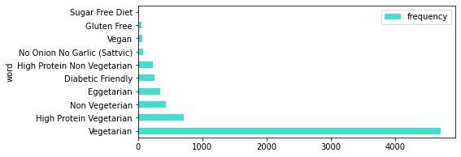
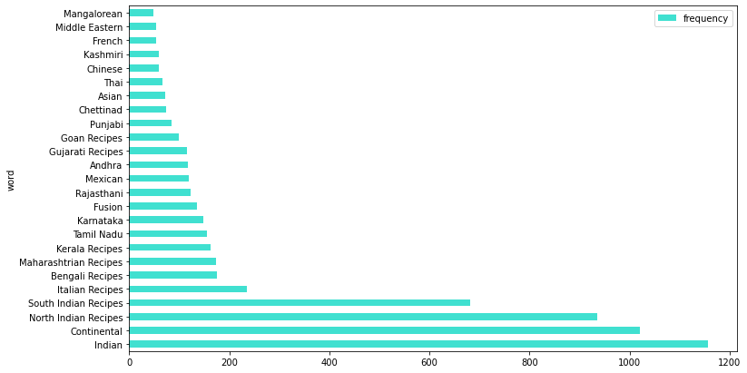
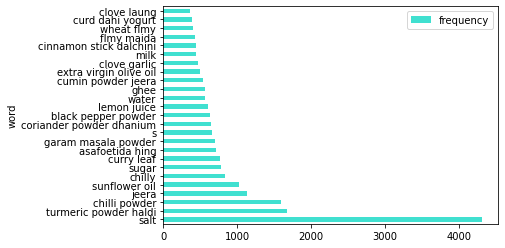

# Train Fasttext language model using Gensim
We use the *6000 Indian Food Recipes* recipe data from here: 
https://www.kaggle.com/kanishk307/6000-indian-food-recipes-dataset


```python
import pandas as pd
import numpy as np
import collections
import gensim 
from gensim.models import word2vec, phrases
from gensim.parsing.preprocessing import remove_stopwords, strip_punctuation, strip_numeric,\
                    strip_non_alphanum, strip_multiple_whitespaces, strip_short
from textblob import TextBlob, Word

import re
import matplotlib.pyplot as plt
import matplotlib.patches as mpatches
import seaborn as sns
%matplotlib inline
```


```python
import os
fc=0
for el in os.listdir("."):
    fc+=1
    print(" - ",el)
print("found",fc,"files!")
```

     -  .ipynb_checkpoints
     -  1_trainRecipeEmbeddings.ipynb
     -  2_indexRecipeData.ipynb
     -  2_trainEmbeddings.ipynb
     -  data
     -  models
     -  processed
     -  recipeEmbeddingsBasedSearch.ipynb
    found 8 files!


```python
raw = pd.read_csv(r"C:\Users\arnab\Documents\workspace\food\whatscooking\downloads\IndianFoodDatasetCSV.csv")
df = raw.copy()
df.head()
```


<div>
<style scoped>
    .dataframe tbody tr th:only-of-type {
        vertical-align: middle;
    }

    .dataframe tbody tr th {
        vertical-align: top;
    }

    .dataframe thead th {
        text-align: right;
    }
</style>
<table border="1" class="dataframe">
  <thead>
    <tr style="text-align: right;">
      <th></th>
      <th>Srno</th>
      <th>RecipeName</th>
      <th>TranslatedRecipeName</th>
      <th>Ingredients</th>
      <th>TranslatedIngredients</th>
      <th>PrepTimeInMins</th>
      <th>CookTimeInMins</th>
      <th>TotalTimeInMins</th>
      <th>Servings</th>
      <th>Cuisine</th>
      <th>Course</th>
      <th>Diet</th>
      <th>Instructions</th>
      <th>TranslatedInstructions</th>
      <th>URL</th>
    </tr>
  </thead>
  <tbody>
    <tr>
      <th>0</th>
      <td>1</td>
      <td>Masala Karela Recipe</td>
      <td>Masala Karela Recipe</td>
      <td>6 Karela (Bitter Gourd/ Pavakkai) - deseeded,S...</td>
      <td>6 Karela (Bitter Gourd/ Pavakkai) - deseeded,S...</td>
      <td>15</td>
      <td>30</td>
      <td>45</td>
      <td>6</td>
      <td>Indian</td>
      <td>Side Dish</td>
      <td>Diabetic Friendly</td>
      <td>To begin making the Masala Karela Recipe,de-se...</td>
      <td>To begin making the Masala Karela Recipe,de-se...</td>
      <td>https://www.archanaskitchen.com/masala-karela-...</td>
    </tr>
    <tr>
      <th>1</th>
      <td>2</td>
      <td>टमाटर पुलियोगरे रेसिपी - Spicy Tomato Rice (Re...</td>
      <td>Spicy Tomato Rice (Recipe)</td>
      <td>2-1/2 कप चावल - पका ले,3 टमाटर,3 छोटा चमच्च बी...</td>
      <td>2-1 / 2 cups rice - cooked, 3 tomatoes, 3 teas...</td>
      <td>5</td>
      <td>10</td>
      <td>15</td>
      <td>3</td>
      <td>South Indian Recipes</td>
      <td>Main Course</td>
      <td>Vegetarian</td>
      <td>टमाटर पुलियोगरे बनाने के लिए सबसे पहले टमाटर क...</td>
      <td>To make tomato puliogere, first cut the tomato...</td>
      <td>http://www.archanaskitchen.com/spicy-tomato-ri...</td>
    </tr>
    <tr>
      <th>2</th>
      <td>3</td>
      <td>Ragi Semiya Upma Recipe - Ragi Millet Vermicel...</td>
      <td>Ragi Semiya Upma Recipe - Ragi Millet Vermicel...</td>
      <td>1-1/2 cups Rice Vermicelli Noodles (Thin),1 On...</td>
      <td>1-1/2 cups Rice Vermicelli Noodles (Thin),1 On...</td>
      <td>20</td>
      <td>30</td>
      <td>50</td>
      <td>4</td>
      <td>South Indian Recipes</td>
      <td>South Indian Breakfast</td>
      <td>High Protein Vegetarian</td>
      <td>To begin making the Ragi Vermicelli Recipe, fi...</td>
      <td>To begin making the Ragi Vermicelli Recipe, fi...</td>
      <td>http://www.archanaskitchen.com/ragi-vermicelli...</td>
    </tr>
    <tr>
      <th>3</th>
      <td>4</td>
      <td>Gongura Chicken Curry Recipe - Andhra Style Go...</td>
      <td>Gongura Chicken Curry Recipe - Andhra Style Go...</td>
      <td>500 grams Chicken,2 Onion - chopped,1 Tomato -...</td>
      <td>500 grams Chicken,2 Onion - chopped,1 Tomato -...</td>
      <td>15</td>
      <td>30</td>
      <td>45</td>
      <td>4</td>
      <td>Andhra</td>
      <td>Lunch</td>
      <td>Non Vegeterian</td>
      <td>To begin making Gongura Chicken Curry Recipe f...</td>
      <td>To begin making Gongura Chicken Curry Recipe f...</td>
      <td>http://www.archanaskitchen.com/gongura-chicken...</td>
    </tr>
    <tr>
      <th>4</th>
      <td>5</td>
      <td>आंध्रा स्टाइल आलम पचड़ी रेसिपी - Adrak Chutney ...</td>
      <td>Andhra Style Alam Pachadi Recipe - Adrak Chutn...</td>
      <td>1 बड़ा चमच्च चना दाल,1 बड़ा चमच्च सफ़ेद उरद दाल,2...</td>
      <td>1 tablespoon chana dal, 1 tablespoon white ura...</td>
      <td>10</td>
      <td>20</td>
      <td>30</td>
      <td>4</td>
      <td>Andhra</td>
      <td>South Indian Breakfast</td>
      <td>Vegetarian</td>
      <td>आंध्रा स्टाइल आलम पचड़ी बनाने के लिए सबसे पहले ...</td>
      <td>To make Andhra Style Alam Pachadi, first heat ...</td>
      <td>https://www.archanaskitchen.com/andhra-style-a...</td>
    </tr>
  </tbody>
</table>
</div>


# Basic insights and data processing


```python
#we keep the Translated versions of Ingredients and Instructions (already pre-processed data)
columns_to_drop = ['RecipeName', 'Ingredients', 'PrepTimeInMins' , 'CookTimeInMins',
                   'TotalTimeInMins', 'Instructions', 'Servings', 'Srno']
df_indianRecipes = df.drop(columns = columns_to_drop).dropna()
df_indianRecipes.head()
```


<div>
<style scoped>
    .dataframe tbody tr th:only-of-type {
        vertical-align: middle;
    }

    .dataframe tbody tr th {
        vertical-align: top;
    }

    .dataframe thead th {
        text-align: right;
    }
</style>
<table border="1" class="dataframe">
  <thead>
    <tr style="text-align: right;">
      <th></th>
      <th>TranslatedRecipeName</th>
      <th>TranslatedIngredients</th>
      <th>Cuisine</th>
      <th>Course</th>
      <th>Diet</th>
      <th>TranslatedInstructions</th>
      <th>URL</th>
    </tr>
  </thead>
  <tbody>
    <tr>
      <th>0</th>
      <td>Masala Karela Recipe</td>
      <td>6 Karela (Bitter Gourd/ Pavakkai) - deseeded,S...</td>
      <td>Indian</td>
      <td>Side Dish</td>
      <td>Diabetic Friendly</td>
      <td>To begin making the Masala Karela Recipe,de-se...</td>
      <td>https://www.archanaskitchen.com/masala-karela-...</td>
    </tr>
    <tr>
      <th>1</th>
      <td>Spicy Tomato Rice (Recipe)</td>
      <td>2-1 / 2 cups rice - cooked, 3 tomatoes, 3 teas...</td>
      <td>South Indian Recipes</td>
      <td>Main Course</td>
      <td>Vegetarian</td>
      <td>To make tomato puliogere, first cut the tomato...</td>
      <td>http://www.archanaskitchen.com/spicy-tomato-ri...</td>
    </tr>
    <tr>
      <th>2</th>
      <td>Ragi Semiya Upma Recipe - Ragi Millet Vermicel...</td>
      <td>1-1/2 cups Rice Vermicelli Noodles (Thin),1 On...</td>
      <td>South Indian Recipes</td>
      <td>South Indian Breakfast</td>
      <td>High Protein Vegetarian</td>
      <td>To begin making the Ragi Vermicelli Recipe, fi...</td>
      <td>http://www.archanaskitchen.com/ragi-vermicelli...</td>
    </tr>
    <tr>
      <th>3</th>
      <td>Gongura Chicken Curry Recipe - Andhra Style Go...</td>
      <td>500 grams Chicken,2 Onion - chopped,1 Tomato -...</td>
      <td>Andhra</td>
      <td>Lunch</td>
      <td>Non Vegeterian</td>
      <td>To begin making Gongura Chicken Curry Recipe f...</td>
      <td>http://www.archanaskitchen.com/gongura-chicken...</td>
    </tr>
    <tr>
      <th>4</th>
      <td>Andhra Style Alam Pachadi Recipe - Adrak Chutn...</td>
      <td>1 tablespoon chana dal, 1 tablespoon white ura...</td>
      <td>Andhra</td>
      <td>South Indian Breakfast</td>
      <td>Vegetarian</td>
      <td>To make Andhra Style Alam Pachadi, first heat ...</td>
      <td>https://www.archanaskitchen.com/andhra-style-a...</td>
    </tr>
  </tbody>
</table>
</div>


```python
#we'll use the embeddings for classification later
counts_ingr = collections.Counter(df_indianRecipes['Diet'])
most_common = counts_ingr.most_common()
mc = pd.DataFrame(most_common, columns=['word', 'frequency'])
mc.plot(kind='barh', x='word', color='turquoise',figsize=(7,3))
```


    <AxesSubplot:ylabel='word'>





```python
#histogram on cuisines
#df_indianRecipes['Cuisine'].hist(xrot=90,figsize=(15,10))
counts_ingr = collections.Counter(df_indianRecipes['Cuisine'])
most_common = counts_ingr.most_common(25)
mc = pd.DataFrame(most_common, columns=['word', 'frequency'])

#print("\nMost common:\n", mc)
mc.plot(kind='barh', x='word', align='center', color='turquoise',figsize=(12,7))
```


    <AxesSubplot:ylabel='word'>





```python
#some more processing, dropping columns in hindi, copied from a notebook in kaggle
#df_indianRecipes = df_indianRecipes['TranslatedIngredients']
def isEnglish(s):
    try:
        s.encode(encoding='utf-8').decode('ascii')
    except UnicodeDecodeError:
        return False
    else:
        return True
    
#create boolean mask
mask = df_indianRecipes['TranslatedIngredients'].apply(isEnglish)
df_indianRecipes = df_indianRecipes[mask].dropna()

print("Shape of recipe data:",df_indianRecipes.shape)
```

    Shape of recipe data: (6173, 7)


```python
#more preprocessing on the text fields
df_indianRecipes['TranslatedIngredients'] = df_indianRecipes['TranslatedIngredients'].apply(lambda x: x.lower())

total_ingredients = []
all_receipes_ingredients =  []
for i in range(len(df_indianRecipes)):
    all_ingredients = list()
    #split each recipe into different ingredients
    try:
        ingred = df_indianRecipes.loc[i, "TranslatedIngredients"][1:-1]
    except:
        continue;
      
    for ing in (ingred.split(',')):
        ing = remove_stopwords(ing)
        ing = strip_numeric(ing)
        ing = re.sub(r'\(.*oz.\)|(®)|(.*ed)|(.*ly)|tast|sprig|inch|purpose|flmy|taste|boneless|skinless|chunks|fresh|large|cook drain|green|frozen|ground|tablespoon|teaspoon|cup','',ing).strip()
        ing = strip_short(ing,2)
        ing = strip_multiple_whitespaces(ing)
        ing = strip_punctuation(ing)
        ing = strip_non_alphanum(ing)
        
        #convert plurals to singular e.g. tomatoes --> tomato
        ing = (" ".join(TextBlob(ing).words.singularize()))
        if len(ing)>0:
            all_ingredients.append(ing)
            total_ingredients.append(ing)
    all_receipes_ingredients.append(all_ingredients)
counts_ingr = collections.Counter(total_ingredients)
```


```python
#find the most common ingredients used across all recipes
print ("---- Most Common Ingredients ----")
print (counts_ingr.most_common(25))

print ("\n")
#find the most common ingredients used across all recipes
print ("---- Least Common Ingredients ----")
print (counts_ingr.most_common()[-10:])
print("type counts ingr",type(counts_ingr))

most_common = counts_ingr.most_common(25)
mc = pd.DataFrame(most_common, columns=['word', 'frequency'])

#print("\nMost common:\n", mc)
mc.plot(kind='barh', x='word', align='center', color='turquoise')
```

    ---- Most Common Ingredients ----
    [('salt', 4315), ('turmeric powder haldi', 1681), ('chilli powder', 1595), ('jeera', 1131), ('sunflower oil', 1030), ('chilly', 842), ('sugar', 779), ('curry leaf', 775), ('asafoetida hing', 712), ('garam masala powder', 699), ('s', 655), ('coriander powder dhanium', 648), ('black pepper powder', 627), ('lemon juice', 612), ('water', 572), ('ghee', 559), ('cumin powder jeera', 535), ('extra virgin olive oil', 503), ('clove garlic', 466), ('milk', 450), ('cinnamon stick dalchini', 440), ('flmy maida', 428), ('wheat flmy', 402), ('curd dahi yogurt', 386), ('clove laung', 369)]
    
    
    ---- Least Common Ingredients ----
    [('cumin powder jeera cumin powder', 1), ('coconut milk consistency', 1), ('coconut oil regular oil', 1), ('turmeric powder haldi to add boiling veggie', 1), ('tamarind paste little', 1), ('gm parwal peel chop straight', 1), ('tsp watermelon', 1), ('egg egg', 1), ('sunflower oil ghee frying parath', 1), ('rose petal garnishing optional', 1)]
    type counts ingr <class 'collections.Counter'>


    <AxesSubplot:ylabel='word'>





```python
#convert to lower case
df_indianRecipes['TranslatedInstructions'] = df_indianRecipes['TranslatedInstructions'].apply(lambda x: x.lower())

#total_ingredients = []
all_instructions =  []

#len(df_indianRecipes)
for i in range(len(df_indianRecipes)):
    #split each recipe into different ingredients
    try:
        instrs = df_indianRecipes.loc[i, "TranslatedInstructions"][1:-1]
        #print("instrs\n",instrs)
    except:
        continue;      
    for instr in (instrs.split('.')):
        instr = remove_stopwords(instr)
        instr = strip_numeric(instr)
        #instr = re.sub(r'\(.*oz.\)|(®)|(.*ed)|(.*ly)|tast|sprig|inch|purpose|flmy|taste|boneless|skinless|chunks|fresh|large|cook drain|green|frozen|ground|tablespoon|teaspoon|cup','',ing).strip()
        instr = strip_short(instr,2)
        instr = strip_multiple_whitespaces(instr)
        instr = strip_punctuation(instr)
        instr = strip_non_alphanum(instr)
        #convert plurals to singular e.g. tomatoes --> tomato
        instr = (" ".join(TextBlob(instr).words.singularize()))
        if len(instr)>0:
            all_instructions.append(instr)

print("len",len(all_instructions))

#formatting the column in a way the gensim takes it
all_instructions_splitted = [sentx.split() for sentx in all_instructions]
df_indianRecipes.to_pickle("processed/df_indianRecipes.pkl")
```

    len 78073


```python
#record the number of ingredients for each recipe, 
#add cleaned instructions for training recipe embeddings
#add cleaned ingredients back to original dataframe
df_indianRecipes['clean_ingredients'] = pd.Series(all_receipes_ingredients)
df_indianRecipes = df_indianRecipes.dropna()
df_indianRecipes['ingredient_count'] =  df_indianRecipes.apply(lambda row: len(row['clean_ingredients']), axis = 1)
df_indianRecipes['clean_instructions'] = df_indianRecipes['TranslatedInstructions'].apply(lambda x: x.lower())
df_indianRecipes['clean_instructions'].head()
```


    0    to begin making the masala karela recipe,de-se...
    1    to make tomato puliogere, first cut the tomato...
    2    to begin making the ragi vermicelli recipe, fi...
    3    to begin making gongura chicken curry recipe f...
    4    to make andhra style alam pachadi, first heat ...
    Name: clean_instructions, dtype: object


```python
df_indianRecipes.to_pickle("processed/df_indianRecipes.pkl")
```


```python
#function to process the column 'recipe' to the format of list-of-lists
import re
from gensim.parsing.preprocessing import remove_stopwords, strip_punctuation, strip_numeric, strip_non_alphanum, strip_multiple_whitespaces, strip_short

def process_recipe(recipe):
    recipeProcessed = []
    for ing in (recipe.split(',')):
        ing = remove_stopwords(ing)
        ing = strip_numeric(ing)
        ing = re.sub(r'\(.*oz.\)|(®)|(.*ed)|(.*ly)|tast|sprig|inch|purpose|flmy|taste|boneless|skinless|chunks|fresh|large|cook drain|green|frozen|ground|tablespoon|teaspoon|recipe|cup','',ing).strip()
        ing = strip_short(ing,2)
        ing = strip_multiple_whitespaces(ing)
        ing = strip_punctuation(ing)
        ing = strip_non_alphanum(ing)
        if ing:
            #print("ing",ing)
            recipeProcessed.append(ing)
    #print("recipeProcessed",len(recipeProcessed),recipeProcessed)
    return [oneInstr.split() for oneInstr in recipeProcessed]

process_recipe(df_indianRecipes['clean_instructions'][10])
```


    [['beans'],
     ['step',
      'cook',
      'them',
      'like',
      'pressure',
      'cooker',
      'method',
      'cook',
      'beans',
      'place',
      'beans',
      'pressure'],
     ['place', 'weight'],
     ['cover', 'pan', 'cook', 'water', 'heat', 'whistles'],
     ['ium',
      'heat',
      'add',
      'onions',
      'garlic',
      'light',
      'sauté',
      'onions',
      'tender',
      'add',
      'tomatoes'],
     ['tomatoes', 'cover', 'pan'],
     ['beans', 'coriander', 'leaves', 'serve', 'toast'],
     ['potato', 'cakes']]


```python
#adding clean instructions
df_indianRecipes['clean_instructions'] = df_indianRecipes['clean_instructions'].apply(lambda x:process_recipe(x))
print(df_indianRecipes['clean_instructions'][1])
```

    [['tomato', 'puliogere'], ['cut', 'tomatoes', 'mixer', 'grinder', 'puree', 'it', 'heat', 'oil', 'pan', 'oil', 'hot'], ['add', 'chana', 'dal'], ['urad', 'dal'], ['cashew', 'let', 'cook', 'seconds', 'seconds'], ['chillies'], ['chillies', 'curry', 'leaves', 'seconds'], ['add', 'tomato', 'puree', 'mix', 'add', 'bc', 'belle', 'bhat', 'powder'], ['salt', 'mix', 'it', 'allow', 'cook', 'minutes', 'turn', 'gas', 'bowl'], ['rice', 'mix', 'it', 'serve', 'hot', 'serve', 'tomato', 'puliogre', 'tomato', 'cucumber', 'raita', 'papad', 'dinner']]


```python
sentenced_Instructions = df_indianRecipes['clean_instructions']
#all_Sentences is the list of sentences in a format that gensim uses
#list of sentences, where every sentence is a list of words
all_Sentences = []
for sentence in sentenced_Instructions:
    all_Sentences.extend(sentence)
print(len(sentenced_Instructions),"recipes!")
print(len(all_Sentences),"sentences!")
```
    5020 recipes!
    49899 sentences!


# recipe embeddings using gensim


```python
#training fastText model on recipe
from gensim.models import FastText
from gensim.test.utils import datapath
from gensim.utils import tokenize
from gensim import utils

model_indianfood_fasttext = FastText(size=100, window=5, min_count=5, workers=4,sg=1)
model_indianfood_fasttext.build_vocab(sentences=all_Sentences)
total_examples = model_indianfood_fasttext.corpus_count
print("training model!")
model_indianfood_fasttext.train(sentences=all_Sentences, total_examples=total_examples, epochs=5)
print("saving model!")
model_indianfood_fasttext.save("models/model_indianfood_fasttext.model")
```

    training model!
    saving model!


```python
#model_indianfood_fasttext.save("models/model_indianfood_fasttext.model")
total_words1 = model_indianfood_fasttext.corpus_total_words
print(total_words1,"words in Recipe based model Corpus!")

model_indianfood_fasttext.wv.most_similar("daal sabji")
```

    327995 words in Recipe based model Corpus!


    [('sukha', 0.9495968222618103),
     ('sukhe', 0.9443870186805725),
     ('sabji', 0.9418803453445435),
     ('vagharela', 0.9411600232124329),
     ('phalguni', 0.938843309879303),
     ('khichia', 0.9387450814247131),
     ('khooba', 0.9372038245201111),
     ('rabodi', 0.9343590140342712),
     ('kanghou', 0.9335325956344604),
     ('sukhi', 0.9331086277961731)]


```python
model_indianfood_fasttext.wv.most_similar("paneer")
```


    [('seer', 0.8310918807983398),
     ('sheer', 0.8263018727302551),
     ('neer', 0.8107001185417175),
     ('bhurji', 0.7945016622543335),
     ('pani', 0.7879313826560974),
     ('pao', 0.7869946956634521),
     ('kulcha', 0.7759062647819519),
     ('macher', 0.7755663394927979),
     ('beer', 0.7722712755203247),
     ('tandoori', 0.7717341780662537)]


```python
model_indianfood_fasttext.wv.most_similar("tandoori")
```


    [('tikka', 0.9459533095359802),
     ('hari', 0.9128848314285278),
     ('kulcha', 0.906612753868103),
     ('bhurji', 0.9024192690849304),
     ('shikampuri', 0.8992996215820312),
     ('katori', 0.8986305594444275),
     ('kulchas', 0.893599271774292),
     ('achari', 0.8933065533638),
     ('shawarma', 0.8896741271018982),
     ('haleem', 0.8863043189048767)]


```python
#defined functions to get to embeddings for recipes
def getSentenceEmbedding(sentence):
    countFound = 0
    embeddingList = []
    for wordx in sentence:
        try:
            vector1 = model_indianfood_fasttext.wv[wordx]
            #print("word",wordx, vector1[:3])
            embeddingList.append(vector1)
            countFound+=1
        except:
            continue;
    sumEmbeddings = sum(embeddingList)
    return np.true_divide(sumEmbeddings, countFound)  

def getRecipeEmbedding(instruction):
    embeddingList = []
    for sentence in instruction:
        embeddingList.append(getSentenceEmbedding(sentence))
    sumEmbeddings = sum(embeddingList)
    return np.true_divide(sumEmbeddings, len(instruction))  
```


```python
df_indianRecipes['recipe_embedding_fasttext'] =  df_indianRecipes.apply(lambda row: getRecipeEmbedding(row['clean_instructions']), axis = 1)
```


```python
#checking out the new column
df_indianRecipes.to_pickle('processed/df_indianRecipes.pkl')
df_indianRecipes.head()
```


<div>
<style scoped>
    .dataframe tbody tr th:only-of-type {
        vertical-align: middle;
    }

    .dataframe tbody tr th {
        vertical-align: top;
    }

    .dataframe thead th {
        text-align: right;
    }
</style>
<table border="1" class="dataframe">
  <thead>
    <tr style="text-align: right;">
      <th></th>
      <th>TranslatedRecipeName</th>
      <th>TranslatedIngredients</th>
      <th>Cuisine</th>
      <th>Course</th>
      <th>Diet</th>
      <th>TranslatedInstructions</th>
      <th>URL</th>
      <th>clean_ingredients</th>
      <th>ingredient_count</th>
      <th>clean_instructions</th>
      <th>recipe_embedding_fasttext</th>
    </tr>
  </thead>
  <tbody>
    <tr>
      <th>0</th>
      <td>Masala Karela Recipe</td>
      <td>6 karela (bitter gourd/ pavakkai) - deseeded,s...</td>
      <td>Indian</td>
      <td>Side Dish</td>
      <td>Diabetic Friendly</td>
      <td>to begin making the masala karela recipe,de-se...</td>
      <td>https://www.archanaskitchen.com/masala-karela-...</td>
      <td>[salt, gram flmy besan, turmeric powder haldi,...</td>
      <td>8</td>
      <td>[[begin, making, masala, karela], [karela, sli...</td>
      <td>[-0.016737932, 0.35984662, -0.24503584, -0.063...</td>
    </tr>
    <tr>
      <th>1</th>
      <td>Spicy Tomato Rice (Recipe)</td>
      <td>2-1 / 2 cups rice - cooked, 3 tomatoes, 3 teas...</td>
      <td>South Indian Recipes</td>
      <td>Main Course</td>
      <td>Vegetarian</td>
      <td>to make tomato puliogere, first cut the tomato...</td>
      <td>http://www.archanaskitchen.com/spicy-tomato-ri...</td>
      <td>[tomato, bc belle bhat powder, salt, chickpea ...</td>
      <td>10</td>
      <td>[[tomato, puliogere], [cut, tomatoes, mixer, g...</td>
      <td>[0.034362823, 0.29279393, -0.15771821, -0.1977...</td>
    </tr>
    <tr>
      <th>2</th>
      <td>Ragi Semiya Upma Recipe - Ragi Millet Vermicel...</td>
      <td>1-1/2 cups rice vermicelli noodles (thin),1 on...</td>
      <td>South Indian Recipes</td>
      <td>South Indian Breakfast</td>
      <td>High Protein Vegetarian</td>
      <td>to begin making the ragi vermicelli recipe, fi...</td>
      <td>http://www.archanaskitchen.com/ragi-vermicelli...</td>
      <td>[rice vermicelli noodle thin, pea matar, chill...</td>
      <td>9</td>
      <td>[[begin, making, ragi, vermicelli], [firm, kee...</td>
      <td>[0.025006209, 0.17075203, -0.1810968, -0.09942...</td>
    </tr>
    <tr>
      <th>3</th>
      <td>Gongura Chicken Curry Recipe - Andhra Style Go...</td>
      <td>500 grams chicken,2 onion - chopped,1 tomato -...</td>
      <td>Andhra</td>
      <td>Lunch</td>
      <td>Non Vegeterian</td>
      <td>to begin making gongura chicken curry recipe f...</td>
      <td>http://www.archanaskitchen.com/gongura-chicken...</td>
      <td>[gram chicken, chilly slit, turmeric powder ha...</td>
      <td>12</td>
      <td>[[ients, aside, in, small, pan], [ium, heat], ...</td>
      <td>[0.0039616567, 0.19029821, -0.08325197, -0.147...</td>
    </tr>
    <tr>
      <th>4</th>
      <td>Andhra Style Alam Pachadi Recipe - Adrak Chutn...</td>
      <td>1 tablespoon chana dal, 1 tablespoon white ura...</td>
      <td>Andhra</td>
      <td>South Indian Breakfast</td>
      <td>Vegetarian</td>
      <td>to make andhra style alam pachadi, first heat ...</td>
      <td>https://www.archanaskitchen.com/andhra-style-a...</td>
      <td>[chana dal, white urad dal, chilly, es ginger ...</td>
      <td>11</td>
      <td>[[andhra, style, alam, pachadi], [chillies], [...</td>
      <td>[0.054038156, 0.27010298, -0.04160401, -0.1178...</td>
    </tr>
  </tbody>
</table>
</div>


```python
#finding similar food-items using trained embeddings only

from numpy import dot
from numpy.linalg import norm

def find_Similar_dish(xx,embeddingToUse):
    #recipe_embedding_fasttext

    a = df_indianRecipes.loc[xx, embeddingToUse]
    orn = df_indianRecipes.loc[xx, "TranslatedRecipeName"]
    #print(orn,"\nGetting most similar dishes based on",embeddingToUse)
    dishtances = {}
    for i in range(len(df_indianRecipes)):
        if i==xx:
            continue;
        try:
            dn = df_indianRecipes.loc[i, "TranslatedRecipeName"]
            b = df_indianRecipes.loc[i, embeddingToUse]
            cos_sim = dot(a, b)/(norm(a)*norm(b))
            if cos_sim not in dishtances.values():
                dishtances[i] = cos_sim
        except:
            continue;
            
    dishtances_2 = {k: v for k, v in sorted(dishtances.items(), key=lambda item: item[1], reverse = True)}
    mostSimilarDishes = []
    countSim = 0
    for el in dishtances_2.keys():
        mostSimilarDishes.append(el)
        countSim+=1
        if countSim==10:
            break;
    return mostSimilarDishes

def list_Similar_dishes(xx, embeddingToUse):
    dn = df_indianRecipes.loc[xx, "TranslatedRecipeName"]
    additionalColumns = ['Cuisine','Course','Diet']
    similarList1 = find_Similar_dish(xx,embeddingToUse)
    simResults1 = []

    allSuggestedDishNames = []
    print("got all similar dishes!")
    for simIndex in similarList1:
        tempRes = []
        dName = df_indianRecipes.loc[simIndex, "TranslatedRecipeName"]
        dishName = " ".join([w for w in dName.split() if w.lower()!='recipe'])
        tempRes.append(dishName)
        dishNameShort = " ".join(dishName.split()[-2:])
        allSuggestedDishNames.append(dishNameShort)
        for col in additionalColumns:
            tempRes.append(df_indianRecipes.loc[simIndex, col])
        simResults1.append(tempRes)
    
    additionalColumns.insert(0,"Dish")
    print(dn)
    return(pd.DataFrame(simResults1, columns = additionalColumns),allSuggestedDishNames)
```


```python
dishNumber = 311
res = list_Similar_dishes(dishNumber, "recipe_embedding_fasttext")
res[0]
```

    got all similar dishes!
    Kashmiri Style Chicken Pulao Recipe


<div>
<style scoped>
    .dataframe tbody tr th:only-of-type {
        vertical-align: middle;
    }

    .dataframe tbody tr th {
        vertical-align: top;
    }

    .dataframe thead th {
        text-align: right;
    }
</style>
<table border="1" class="dataframe">
  <thead>
    <tr style="text-align: right;">
      <th></th>
      <th>Dish</th>
      <th>Cuisine</th>
      <th>Course</th>
      <th>Diet</th>
    </tr>
  </thead>
  <tbody>
    <tr>
      <th>0</th>
      <td>Veg Makhanwala - North Indian Mixed Vegetables...</td>
      <td>North Indian Recipes</td>
      <td>Lunch</td>
      <td>Vegetarian</td>
    </tr>
    <tr>
      <th>1</th>
      <td>Bengali Doi Maach (Fish In Yogurt Curry)</td>
      <td>Bengali Recipes</td>
      <td>Lunch</td>
      <td>Non Vegeterian</td>
    </tr>
    <tr>
      <th>2</th>
      <td>Bhindi Masala Gravy - Ladies Finger In Tomato ...</td>
      <td>North Indian Recipes</td>
      <td>Side Dish</td>
      <td>Vegetarian</td>
    </tr>
    <tr>
      <th>3</th>
      <td>Andhra Style Chicken Fry</td>
      <td>Andhra</td>
      <td>Appetizer</td>
      <td>High Protein Non Vegetarian</td>
    </tr>
    <tr>
      <th>4</th>
      <td>Delicious Methi Chicken Curry - Murgh Methi Curry</td>
      <td>North Indian Recipes</td>
      <td>Dinner</td>
      <td>Non Vegeterian</td>
    </tr>
    <tr>
      <th>5</th>
      <td>Chettinad Muttai Masala - Chettinad Style Egg ...</td>
      <td>Chettinad</td>
      <td>Lunch</td>
      <td>Eggetarian</td>
    </tr>
    <tr>
      <th>6</th>
      <td>Thalapakattu Chicken Biryani</td>
      <td>Tamil Nadu</td>
      <td>Main Course</td>
      <td>Non Vegeterian</td>
    </tr>
    <tr>
      <th>7</th>
      <td>Lugai Gosht - Mutton In Spicy Tomato Onion Gravy</td>
      <td>North Indian Recipes</td>
      <td>Dinner</td>
      <td>Non Vegeterian</td>
    </tr>
    <tr>
      <th>8</th>
      <td>Punjabi Style Egg Curry</td>
      <td>Punjabi</td>
      <td>Lunch</td>
      <td>Eggetarian</td>
    </tr>
    <tr>
      <th>9</th>
      <td>Chettinad Thakkali Sadam (Chettinad Style Toma...</td>
      <td>Chettinad</td>
      <td>Lunch</td>
      <td>Gluten Free</td>
    </tr>
  </tbody>
</table>
</div>


```python
dishNumber = 567
res = list_Similar_dishes(dishNumber, "recipe_embedding_fasttext")
res[0]
```

    got all similar dishes!
    Homemade Easy Gulab Jamun Recipe - Delicious & Tasty


<div>
<style scoped>
    .dataframe tbody tr th:only-of-type {
        vertical-align: middle;
    }

    .dataframe tbody tr th {
        vertical-align: top;
    }

    .dataframe thead th {
        text-align: right;
    }
</style>
<table border="1" class="dataframe">
  <thead>
    <tr style="text-align: right;">
      <th></th>
      <th>Dish</th>
      <th>Cuisine</th>
      <th>Course</th>
      <th>Diet</th>
    </tr>
  </thead>
  <tbody>
    <tr>
      <th>0</th>
      <td>Malpua with Rabri (A Spiced Indian Pancake wit...</td>
      <td>Indian</td>
      <td>Dessert</td>
      <td>Vegetarian</td>
    </tr>
    <tr>
      <th>1</th>
      <td>Ragi, Wheat &amp; Oat Waffles With Maple Syrup</td>
      <td>Continental</td>
      <td>World Breakfast</td>
      <td>Eggetarian</td>
    </tr>
    <tr>
      <th>2</th>
      <td>Kaju Pista Roll - Cashew Nut Pistachio Fudge</td>
      <td>North Indian Recipes</td>
      <td>Dessert</td>
      <td>Vegetarian</td>
    </tr>
    <tr>
      <th>3</th>
      <td>Basbousa - Middle Eastern Semolina Cake</td>
      <td>Middle Eastern</td>
      <td>Snack</td>
      <td>Vegetarian</td>
    </tr>
    <tr>
      <th>4</th>
      <td>Homemade Whole Wheat Pav / Ladi Pav</td>
      <td>Goan Recipes</td>
      <td>Side Dish</td>
      <td>Vegetarian</td>
    </tr>
    <tr>
      <th>5</th>
      <td>Eggless Chocolate Chip And Honey Cookies</td>
      <td>Continental</td>
      <td>Snack</td>
      <td>Vegetarian</td>
    </tr>
    <tr>
      <th>6</th>
      <td>Eggless Fudgy Chocolate Chunk Brownie</td>
      <td>Continental</td>
      <td>Dessert</td>
      <td>Vegetarian</td>
    </tr>
    <tr>
      <th>7</th>
      <td>Chiroti - Delicious Crispy Layered Sweet Puri</td>
      <td>Indian</td>
      <td>Dessert</td>
      <td>Vegetarian</td>
    </tr>
    <tr>
      <th>8</th>
      <td>Karachi Biscuits</td>
      <td>Indian</td>
      <td>Snack</td>
      <td>Vegetarian</td>
    </tr>
    <tr>
      <th>9</th>
      <td>Strawberry Brownie Bars</td>
      <td>Continental</td>
      <td>Dessert</td>
      <td>Eggetarian</td>
    </tr>
  </tbody>
</table>
</div>


# Indexing Recipe data with embeddings onto ElasticSearch and Query Search
We need to have an Elasticsearch server running. In this code we'll use the elasticsearch Python API to access the server we started at the default setting of localhost port 9200


```python
#defining the elasticsearch mapping(schema) for our data we are going to index. We're indexing, ID, Dish (food-item-name), cuisine, diet, and recipe_embedding

from elasticsearch import Elasticsearch 
import numpy as np
import pandas as pd
import json

# we define a dense vector named recipe_embedding
# it is mandatory to spezify the dims, which is the size of your embeddings
# i've trained embeddings of size 100
newschema = { "mappings": {
    "properties": {
            "id": {
                "type": "text"
            },
            "dish": {
                "type": "keyword"
            },
            "cuisine": {
                "type": "keyword"
            },                
            "diet": {
                "type": "keyword"
            },
            "recipe_embedding": {
                "type": "dense_vector",
                "dims": 100
            }
    }
}
}

# Connecting to Elasticsearch server
es = Elasticsearch([{'host': 'localhost', 'port': 9200}])

```


```python
'''
Create index called recipedata1, specifying our mapping with body=newschema
and delete indices. 
es might show errors but still create and index, hence in order to delete a previously created index use this command below
'''
es.indices.delete(index='recipedata1', ignore=[400, 404])
es.indices.create(index="recipedata1", ignore=400, body=newschema)
```


    {'acknowledged': True, 'shards_acknowledged': True, 'index': 'recipedata1'}


```python
recipeData = pd.read_pickle("processed/df_indianRecipes.pkl")
recipeData.head()
```


<div>
<style scoped>
    .dataframe tbody tr th:only-of-type {
        vertical-align: middle;
    }

    .dataframe tbody tr th {
        vertical-align: top;
    }

    .dataframe thead th {
        text-align: right;
    }
</style>
<table border="1" class="dataframe">
  <thead>
    <tr style="text-align: right;">
      <th></th>
      <th>TranslatedRecipeName</th>
      <th>TranslatedIngredients</th>
      <th>Cuisine</th>
      <th>Course</th>
      <th>Diet</th>
      <th>TranslatedInstructions</th>
      <th>URL</th>
      <th>clean_ingredients</th>
      <th>ingredient_count</th>
      <th>clean_instructions</th>
      <th>recipe_embedding_fasttext</th>
    </tr>
  </thead>
  <tbody>
    <tr>
      <th>0</th>
      <td>Masala Karela Recipe</td>
      <td>6 karela (bitter gourd/ pavakkai) - deseeded,s...</td>
      <td>Indian</td>
      <td>Side Dish</td>
      <td>Diabetic Friendly</td>
      <td>to begin making the masala karela recipe,de-se...</td>
      <td>https://www.archanaskitchen.com/masala-karela-...</td>
      <td>[salt, gram flmy besan, turmeric powder haldi,...</td>
      <td>8</td>
      <td>[[begin, making, masala, karela], [karela, sli...</td>
      <td>[-0.016737932, 0.35984662, -0.24503584, -0.063...</td>
    </tr>
    <tr>
      <th>1</th>
      <td>Spicy Tomato Rice (Recipe)</td>
      <td>2-1 / 2 cups rice - cooked, 3 tomatoes, 3 teas...</td>
      <td>South Indian Recipes</td>
      <td>Main Course</td>
      <td>Vegetarian</td>
      <td>to make tomato puliogere, first cut the tomato...</td>
      <td>http://www.archanaskitchen.com/spicy-tomato-ri...</td>
      <td>[tomato, bc belle bhat powder, salt, chickpea ...</td>
      <td>10</td>
      <td>[[tomato, puliogere], [cut, tomatoes, mixer, g...</td>
      <td>[0.034362823, 0.29279393, -0.15771821, -0.1977...</td>
    </tr>
    <tr>
      <th>2</th>
      <td>Ragi Semiya Upma Recipe - Ragi Millet Vermicel...</td>
      <td>1-1/2 cups rice vermicelli noodles (thin),1 on...</td>
      <td>South Indian Recipes</td>
      <td>South Indian Breakfast</td>
      <td>High Protein Vegetarian</td>
      <td>to begin making the ragi vermicelli recipe, fi...</td>
      <td>http://www.archanaskitchen.com/ragi-vermicelli...</td>
      <td>[rice vermicelli noodle thin, pea matar, chill...</td>
      <td>9</td>
      <td>[[begin, making, ragi, vermicelli], [firm, kee...</td>
      <td>[0.025006209, 0.17075203, -0.1810968, -0.09942...</td>
    </tr>
    <tr>
      <th>3</th>
      <td>Gongura Chicken Curry Recipe - Andhra Style Go...</td>
      <td>500 grams chicken,2 onion - chopped,1 tomato -...</td>
      <td>Andhra</td>
      <td>Lunch</td>
      <td>Non Vegeterian</td>
      <td>to begin making gongura chicken curry recipe f...</td>
      <td>http://www.archanaskitchen.com/gongura-chicken...</td>
      <td>[gram chicken, chilly slit, turmeric powder ha...</td>
      <td>12</td>
      <td>[[ients, aside, in, small, pan], [ium, heat], ...</td>
      <td>[0.0039616567, 0.19029821, -0.08325197, -0.147...</td>
    </tr>
    <tr>
      <th>4</th>
      <td>Andhra Style Alam Pachadi Recipe - Adrak Chutn...</td>
      <td>1 tablespoon chana dal, 1 tablespoon white ura...</td>
      <td>Andhra</td>
      <td>South Indian Breakfast</td>
      <td>Vegetarian</td>
      <td>to make andhra style alam pachadi, first heat ...</td>
      <td>https://www.archanaskitchen.com/andhra-style-a...</td>
      <td>[chana dal, white urad dal, chilly, es ginger ...</td>
      <td>11</td>
      <td>[[andhra, style, alam, pachadi], [chillies], [...</td>
      <td>[0.054038156, 0.27010298, -0.04160401, -0.1178...</td>
    </tr>
  </tbody>
</table>
</div>


# Data ingestion scripts
- Converting data to JSON like format
- Connecting to Elasticsearch server using elasticsearch python api
- Creating a new index and indexing our data


```python
'''
we have stored our file we want to index, and can read it any way we want, 
we need to convert each row of the dataframe into JSON-like, and can store it in a python list 
'''

ldocs = []
for rd in range(len(recipeData)):
    d = {}
    d['id'] = str(rd)
    try:
        d['dish'] = recipeData.loc[rd, "TranslatedRecipeName"]
        d['cuisine'] = recipeData.loc[rd, "Cuisine"]
        d['course'] = recipeData.loc[rd, "Course"]
        d['diet'] = recipeData.loc[rd, "Diet"]
        d['recipe_embedding'] = np.asarray(recipeData.loc[rd, "recipe_embedding_fasttext"]).tolist()
        ldocs.append(d)
    except:
        continue;
```

# dense-vector based search in ElasticSearch
We have embeddings for all dishes/food-items. Now, given a query at runtime, we have to get its *query-embedding*
The query embedding is nothing but *sentence-embedding*

The query is a sentence and we use the function *getSentenceEmbedding(sentence)* to get the query-embeddings. 
The function *getSimilarFood(query)* creates a custom query for elasticsearch using *script_score* 


```python
from gensim.models import FastText

'''
loading our previously trained model in loaded_model
'''
loaded_model = FastText.load(r'C:\Users\arnab\Documents\workspace\food\whatscooking\models\model_indianfood_fasttext.model')

'''
function that creates sentence embeddings given a language model
loaded_model has the model we trained in previous step
'''
def getSentenceEmbedding(sentence):
    countFound = 0
    embeddingList = []
    for wordx in sentence:
        try:
            vector1 = loaded_model.wv[wordx]
            #print("word",wordx, vector1[:3])
            embeddingList.append(vector1)
            countFound+=1
        except:
            continue;
    sumEmbeddings = sum(embeddingList)
    return np.true_divide(sumEmbeddings, countFound)  
'''
Custom Elasticsearch search request throughg api function
'''
def getSimilarFood(query):
    query_emb = getSentenceEmbedding(query.split())
    script_query = { "script_score": {
        "query": {"match_all": {}},
        "script": {
          "source": "cosineSimilarity(params.query_vector, 'recipe_embedding') + 1.0",
          "params": {"query_vector": query_emb}}}}
    response = es.search(index = "recipedata2", body = {"query": script_query})
    resfinal = []
    
    '''
    you can explore the response variable to figure out more, 
    but the values of the fields we need are in response['hits']['hits']
    '''
    for el in response['hits']['hits']:
        dname = el['_source']['dish']
        dishName = " ".join([w for w in dname.split() if w.lower()!='recipe'])
        resfinal.append(dishName)
    return pd.DataFrame(resfinal,columns=['Recommended Dishes!'])
```

# exploring the results 
Here we'll input ingredients (tomatoes, bread, spinach, etc) and procedures (bake, boil, fry, etc), 
and we hope to get suggested matching dishes while searching with dense embeddings in ElasticSearch


```python
getSimilarFood("flour yeast onions mozarella cheese")
```


<div>
<style scoped>
    .dataframe tbody tr th:only-of-type {
        vertical-align: middle;
    }

    .dataframe tbody tr th {
        vertical-align: top;
    }

    .dataframe thead th {
        text-align: right;
    }
</style>
<table border="1" class="dataframe">
  <thead>
    <tr style="text-align: right;">
      <th></th>
      <th>Recommended Dishes!</th>
    </tr>
  </thead>
  <tbody>
    <tr>
      <th>0</th>
      <td>Whole Wheat Stuffed Breadsticks</td>
    </tr>
    <tr>
      <th>1</th>
      <td>Egg And Spinach Breakfast Pizza</td>
    </tr>
    <tr>
      <th>2</th>
      <td>Mexican Style Vegetarian Chimichanga Recipe-De...</td>
    </tr>
    <tr>
      <th>3</th>
      <td>Garlic Crust Vegetable Pizza</td>
    </tr>
    <tr>
      <th>4</th>
      <td>Veggie Pearl Millet Tart</td>
    </tr>
    <tr>
      <th>5</th>
      <td>Mini Chilli Cheese Aloo Kulcha</td>
    </tr>
    <tr>
      <th>6</th>
      <td>Whole Wheat Sun Dried Tomato Focaccia Bread | ...</td>
    </tr>
    <tr>
      <th>7</th>
      <td>Oven Crisped Burritos with Shredded Chicken</td>
    </tr>
    <tr>
      <th>8</th>
      <td>Mushroom Quiche</td>
    </tr>
    <tr>
      <th>9</th>
      <td>Chicken Crepe Lasagne</td>
    </tr>
  </tbody>
</table>
</div>


```python
getSimilarFood("chicken tandoori")
```


<div>
<style scoped>
    .dataframe tbody tr th:only-of-type {
        vertical-align: middle;
    }

    .dataframe tbody tr th {
        vertical-align: top;
    }

    .dataframe thead th {
        text-align: right;
    }
</style>
<table border="1" class="dataframe">
  <thead>
    <tr style="text-align: right;">
      <th></th>
      <th>Recommended Dishes!</th>
    </tr>
  </thead>
  <tbody>
    <tr>
      <th>0</th>
      <td>Paprika Chicken Skewers</td>
    </tr>
    <tr>
      <th>1</th>
      <td>Baked Paneer Corn Kebab</td>
    </tr>
    <tr>
      <th>2</th>
      <td>Chicken Tikka Taco Topped With Cheesy Garlic Mayo</td>
    </tr>
    <tr>
      <th>3</th>
      <td>Baked Fish Crisps (Fish Fry In Oven)</td>
    </tr>
    <tr>
      <th>4</th>
      <td>Beetroot Chicken Cutlets</td>
    </tr>
    <tr>
      <th>5</th>
      <td>Chicken Malai Kabab</td>
    </tr>
    <tr>
      <th>6</th>
      <td>Potato Roulade</td>
    </tr>
    <tr>
      <th>7</th>
      <td>Rosemary And Thyme Chicken</td>
    </tr>
    <tr>
      <th>8</th>
      <td>Spicy Kiwi Salsa with Feta Cheese</td>
    </tr>
    <tr>
      <th>9</th>
      <td>Crispy Vegetable Tempura</td>
    </tr>
  </tbody>
</table>
</div>


```python
#baked items 
getSimilarFood("flour oil bake tomato cheese olive oregano")
```


<div>
<style scoped>
    .dataframe tbody tr th:only-of-type {
        vertical-align: middle;
    }

    .dataframe tbody tr th {
        vertical-align: top;
    }

    .dataframe thead th {
        text-align: right;
    }
</style>
<table border="1" class="dataframe">
  <thead>
    <tr style="text-align: right;">
      <th></th>
      <th>Recommended Dishes!</th>
    </tr>
  </thead>
  <tbody>
    <tr>
      <th>0</th>
      <td>Halloumi Bruschetta with Tomato and Roasted Re...</td>
    </tr>
    <tr>
      <th>1</th>
      <td>Cheesy Vegetarian Pizza Muffins</td>
    </tr>
    <tr>
      <th>2</th>
      <td>Bloomed Potato Cheesy Muffins</td>
    </tr>
    <tr>
      <th>3</th>
      <td>Four Cheese and Spinach Stuffed Mushrooms</td>
    </tr>
    <tr>
      <th>4</th>
      <td>Roasted Vegetable Pasta Primavera</td>
    </tr>
    <tr>
      <th>5</th>
      <td>Chicken Crepe Lasagne</td>
    </tr>
    <tr>
      <th>6</th>
      <td>Cauliflower Crust Pizza With Pesto, Sundried T...</td>
    </tr>
    <tr>
      <th>7</th>
      <td>Spinach And Soya Sub Sandwich</td>
    </tr>
    <tr>
      <th>8</th>
      <td>Mini Pita Pizza With Tahini Roasted Vegetables</td>
    </tr>
    <tr>
      <th>9</th>
      <td>Roasted Eggplant Parmigiana</td>
    </tr>
  </tbody>
</table>
</div>


```python
#Palak=Spinach in Hindi
getSimilarFood("paneer tomatoes palak")
```


<div>
<style scoped>
    .dataframe tbody tr th:only-of-type {
        vertical-align: middle;
    }

    .dataframe tbody tr th {
        vertical-align: top;
    }

    .dataframe thead th {
        text-align: right;
    }
</style>
<table border="1" class="dataframe">
  <thead>
    <tr style="text-align: right;">
      <th></th>
      <th>Recommended Dishes!</th>
    </tr>
  </thead>
  <tbody>
    <tr>
      <th>0</th>
      <td>Chatpata Lobia Chaat - Healthy Black Eyed Bean...</td>
    </tr>
    <tr>
      <th>1</th>
      <td>Spicy Paneer Bhurji Pav Sandwich - Breakfast</td>
    </tr>
    <tr>
      <th>2</th>
      <td>Oats Cheela Stuffed With Creamy Palak Paneer</td>
    </tr>
    <tr>
      <th>3</th>
      <td>Paneer Onion Paratha</td>
    </tr>
    <tr>
      <th>4</th>
      <td>Tofu Bhurji - Spicy Scrambled Tofu</td>
    </tr>
    <tr>
      <th>5</th>
      <td>Stuffed Bhindi With Paneer (Recipe In Hindi)</td>
    </tr>
    <tr>
      <th>6</th>
      <td>Bathua Aloo Paratha</td>
    </tr>
    <tr>
      <th>7</th>
      <td>Peshawari Karahi Gosht</td>
    </tr>
    <tr>
      <th>8</th>
      <td>Kabuli Chana &amp; Moongphali Salad</td>
    </tr>
    <tr>
      <th>9</th>
      <td>Sweet &amp; Spicy Stuffed Paneer In Kofta Curry</td>
    </tr>
  </tbody>
</table>
</div>


```python
getSimilarFood("milk strawberry banana")
```


<div>
<style scoped>
    .dataframe tbody tr th:only-of-type {
        vertical-align: middle;
    }

    .dataframe tbody tr th {
        vertical-align: top;
    }

    .dataframe thead th {
        text-align: right;
    }
</style>
<table border="1" class="dataframe">
  <thead>
    <tr style="text-align: right;">
      <th></th>
      <th>Recommended Dishes!</th>
    </tr>
  </thead>
  <tbody>
    <tr>
      <th>0</th>
      <td>Chocolate Banana Smoothie Bowl</td>
    </tr>
    <tr>
      <th>1</th>
      <td>Strawberry Smoothie Bowl with chia seeds and M...</td>
    </tr>
    <tr>
      <th>2</th>
      <td>Oreo Milkshake</td>
    </tr>
    <tr>
      <th>3</th>
      <td>Banana And Mango Smoothie</td>
    </tr>
    <tr>
      <th>4</th>
      <td>Peanut Butter Oat Almond Energy Bar</td>
    </tr>
    <tr>
      <th>5</th>
      <td>Uttarakhand Style Singhal</td>
    </tr>
    <tr>
      <th>6</th>
      <td>Banana Digestive Pudding With Pistachios</td>
    </tr>
    <tr>
      <th>7</th>
      <td>Dragon Fruit and Rose Water Popsicle</td>
    </tr>
    <tr>
      <th>8</th>
      <td>Spinach Dates &amp; Banana Smoothie</td>
    </tr>
    <tr>
      <th>9</th>
      <td>Overnight Oats (No Cook Blueberry Vanilla and ...</td>
    </tr>
  </tbody>
</table>
</div>


```python
getSimilarFood("bhel puffed mix lemon")
```


<div>
<style scoped>
    .dataframe tbody tr th:only-of-type {
        vertical-align: middle;
    }

    .dataframe tbody tr th {
        vertical-align: top;
    }

    .dataframe thead th {
        text-align: right;
    }
</style>
<table border="1" class="dataframe">
  <thead>
    <tr style="text-align: right;">
      <th></th>
      <th>Recommended Dishes!</th>
    </tr>
  </thead>
  <tbody>
    <tr>
      <th>0</th>
      <td>Watermelon Margarita Granita</td>
    </tr>
    <tr>
      <th>1</th>
      <td>Crunchy Carrots In Hot Dogs Buns</td>
    </tr>
    <tr>
      <th>2</th>
      <td>Healthy Fresh Vegetable Salad Bowl with Sour Y...</td>
    </tr>
    <tr>
      <th>3</th>
      <td>Sweet Potato &amp; Rosemary Crisps/ Chips</td>
    </tr>
    <tr>
      <th>4</th>
      <td>Lemon Pudina Curry Leaf Shikanji</td>
    </tr>
    <tr>
      <th>5</th>
      <td>Kiwi Guava Spritzer</td>
    </tr>
    <tr>
      <th>6</th>
      <td>Spinach Watermelon Salad With Walnuts</td>
    </tr>
    <tr>
      <th>7</th>
      <td>Spinach &amp; Apple Salad With Orange Dressing</td>
    </tr>
    <tr>
      <th>8</th>
      <td>Strawberry Mojito</td>
    </tr>
    <tr>
      <th>9</th>
      <td>Kiwi Basil Lemonade</td>
    </tr>
  </tbody>
</table>
</div>


# Thank you everyone!
